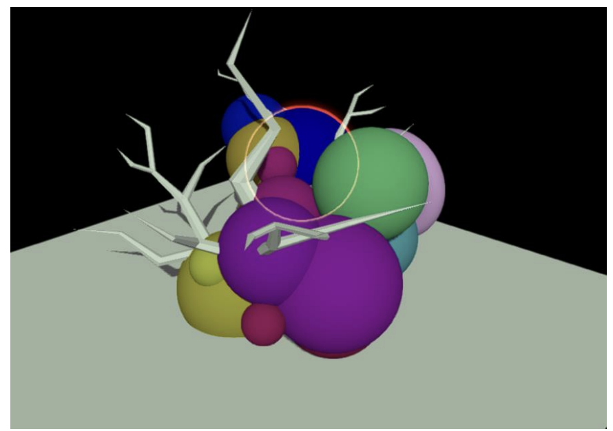

# Snaptrude Assignment


## Video demo
https://spiti.xyz/embedv/IfJE0xrSCH84biHxBJsf-1e38ddbb-ac39-495e-bf1d-99dec4fe294c


## Tasks
### Task 1
1. Create a Babylon scene with 2-3 meshes, using the built-in mesh builder.
2. Import a custom .obj mesh of your choice into the scene.
3. Position these meshes in a manner that results in some form of overlap.

### Task 2
1. Write a script to return a mesh object when the mouse hovers over it in the scene, else return null.
2. Write a shader to generate an outline around the returned mesh object.
3. If there is not mesh object selected, no mesh should be outlined.
4. Keep the shader(s) in a separate file for better readability.

### Bonus Task
For additional credit, design a user interface (UI) that allows users to modify the colour and thickness of the outline.
You can choose various input methods, such as text inputs, sliders, or a colour wheel.

## Installation

> ### Pre text
> This assingment is done using Babylon.js and uses a simple Vite server to spin up the application.
>
>Vite was chosen as it is a very fast and simple server to spin up and get started with. It also has a very good hot reloading feature which makes it very easy to develop .


Install dependencies
```bash
  yarn
```
Run the dev server
```bash
  yarn dev
```


### Approaches 


#### Task 1

Created a scene with a couple of meshes using the built in mesh builder. And created a ground plane to place the meshes on.

Also imported a custom .obj mesh using the built in Async loader. 

Positioned the meshes in a manner that results in some form of overlap using the position property of the mesh.

> Also using a non specular light ( more on that later )


#### Task 2

a ) To return a mesh object when the mouse hovers over it in the scene, else return null.

I have used the mesh actionManager and added events to the mesh to detect when the mouse is over the mesh and when the mouse is out of the mesh.

./src/events.ts

1.  `checkHoveredMesh` which initializes the action manager and adds the events to the mesh.
It recives a callback function which is called when the mouse is over the mesh and when the mouse is out of the mesh.

2. `handleMeshHover` which is the main function that handles the mesh hover events. It initializes the action manager and adds the events to the mesh.

    Also it intializes the post processing for the mesh. ( more on that later )


b) Write a shader to generate an outline around the returned mesh object.


Some clarifications before we start.

The diagram given in the assigment(refer below)




Might be refering to a highlight effect rather than an outline effect. However considering the time constraints I have implemented an outline effect.


Apporaches not taken

1) Duplicate the mesh and scale it up to create an outline effect.

    This would be a valid approach altho the outline effect might not be visible through other meshes.

2) Using a blur filter and a shader to apply the blur filter to the mesh.

    This would be a valid approach tho the blur would not be ideal for an outline effect.


To create the outline effect I have used a slighlty modified Sobel Edge Detection shader(`./public/shaders/sobel.fragment`)

The render pipeline works we are using is the `RenderTargetTexture` to allow multiple passes . 

Also RenderTargetTexture helps us keep track of the highlighted mesh and the non highlighted mesh.


1. Create a passthrough shader which renders the scene as is to preserve the non outlined meshes.

2. Create a shader which combines the passthrough shader and the sobel shader to create the outline effect.


#### Bonus Task

For additional credit, design a user interface (UI) that allows users to modify the colour and thickness of the outline.


I used Babylon's internal GUI library to create the UI.

The ui resides in `./src/ui.js`

The UI has one slider for thickness and one color picker 


## Some notes

1. I have used a non specular light as it is easier to see the outline effect. Without it the outline was messing up with the specular highlights.

    I know this is fixable but I have not had the time to fix it. Ideally another solution with a highlight layer or using a better color mixer could fix it. 


2. I can also see the overlay effect on the outline. This is because of the way the sobel shader works. It is not a perfect solution but it works for the most part , specifically for non round meshes.


3. Techically could have used a better algorithm for the outline effect. But I have used the sobel shader as it is a very simple shader and works for the most part. Altho it took me a while to get it working.


4. I have used a simple UI for the bonus task. Ideally it would have inputs and text labels for the UI. But I have used a simple slider and a color picker for the sake of time.


5. I have used the RenderTargetTexture to create the outline effect. Could've been done using a post processing pipeline. But the RenderTargetTexture was easier toi implement and can ideally scale to multiple meshes and multiple passes.


